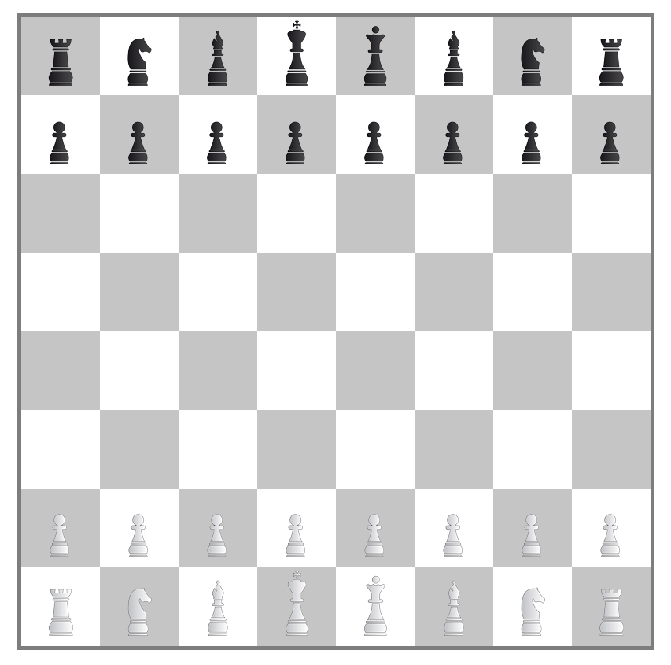

# Challenge : Chess 2.0

## Objectif

Le but : créer les cases, puis les pièces d'un échiquier.  
Puis pouvoir faire bouger les pièces dans les cases !

## Instructions

Le fichier JS contient déjà un certain nombre d'informations.  
Cela devrait être suffisant pour comprendre ce qu'il y a à coder.

Le fichier `base.css` contient déjà les classes permettant
d'afficher les pièces, à condition d'utiliser les bonnes
classes !

