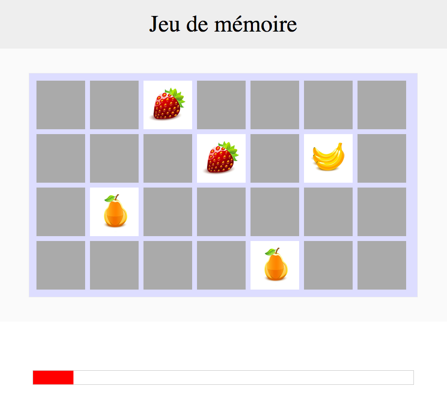

# Memory

Le but est de coder un mini-jeu en HTML / CSS / JS.  
Il s’agit du jeu “memory” :

* Des cartes sont disposées face cachée à l'écran.

* Le joueur doit cliquer sur deux cartes. Si celles-ci sont identiques, la paire est validée. Sinon, les cartes sont retournées face cachée, et le joueur doit sélectionner une nouvelle paire de cartes.

* Le joueur gagne s'il arrive à découvrir toutes les paires avant la fin du temps imparti.

Ready? C'est parti !

## Instructions

1. [On installe](docs/1_on-installe.md)
2. [On retourne](docs/2_on-retourne.md)
3. [La face visible](docs/3_la-face-visible.md)
4. [Une paire ?](docs/4_une-paire.md)
5. [Veni, vidi, vici](docs/5_veni-vedi-vici.md)
6. [Compte à rebours](docs/6_compte-a-rebours.md)

Pour ceux qui ont envie de pousser le bouchon, c'est par ici : [BONUS](docs/7_bonus.md)

## Conseils

Si la tâche semble harassante, pas d’inquiétude ! Chaque étape est détaillée pour avancer petit à petit. Ne vous précipitez pas, et faites les choses bien. Quelques conseils :

* Lisez tout l’énoncé dès le début, pour savoir où vous allez.

* Prenez le temps de coder, en commentant votre code dès qu’il est nécessaire, pourquoi pas en copiant la consigne en commentaire.

* Gardez des fonctions simples, qui ne font qu’une seule chose, pour mieux vous y retrouver.

* Plus les premières étapes seront bien codées, plus la suite sera facile !

* Quelques liens vous sont glissés à chaque étape pour vous donner des indices, mais aussi vous permettre de bien comprendre ce qui est demandé.

---

Amusez-vous bien, et allez le plus loin possible ! ✌️
