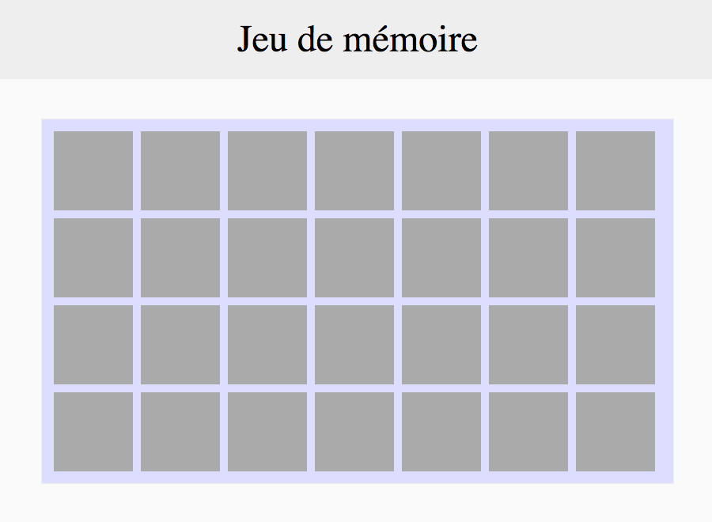

# On installe

On installe le plateau et les cartes

## Instructions

### Plateau

Le header et le plateau qui contient les cartes sont à créer directement en HTML / CSS.

### Cartes

Les 28 cartes, qu'on appellera `.carte`, doivent être créées en javascript à l'aide d'une boucle.
On *peut* stocker chacun des éléments créés dans un array, puis ajouter cet array au plateau.

Les `.carte` mesurent 100x100 pixels.

Chaque carte possède deux éléments enfants :
* la face cachée, qu’on appellera `.cache`.  
`.cache` est affiché et possède un fond gris.

* la face visible, qu’on appellera `.image`.  
`.image` est caché avec un fond blanc.

--

La suite : [On retourne](2_on-retourne.md)

---

## Help

* http://api.jquery.com/jquery/#jQuery2
* http://api.jquery.com/append/
