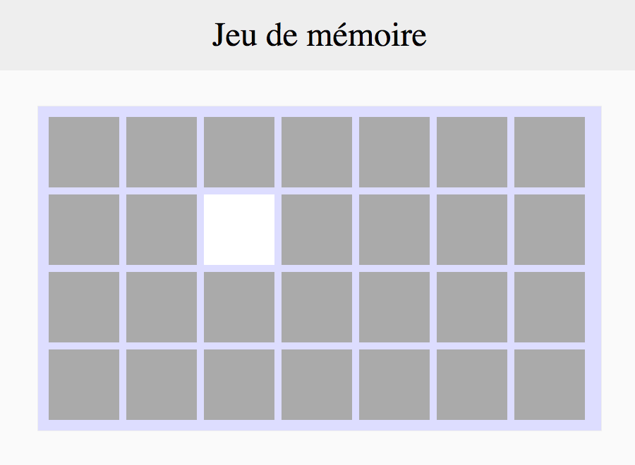

# On retourne !

Le joueur peut cliquer sur une carte pour la retourner.

## Instructions

Au click sur une `.carte`, il faut masquer `.cache` et afficher `.image`.  
On peut faire ça en rajoutant une classe, ou en modifiant directement le style des éléments par exemple.

Pour un plus bel effet, on applique un gris plus foncé sur la carte au passage de la souris.

--

La suite : [La face visible](3_la-face-visible.md)

---

## Help

* https://developer.mozilla.org/fr/docs/Web/API/EventTarget/addEventListener
* http://api.jquery.com/on/
* http://api.jquery.com/addClass/
* http://api.jquery.com/show/
* http://api.jquery.com/hide/
