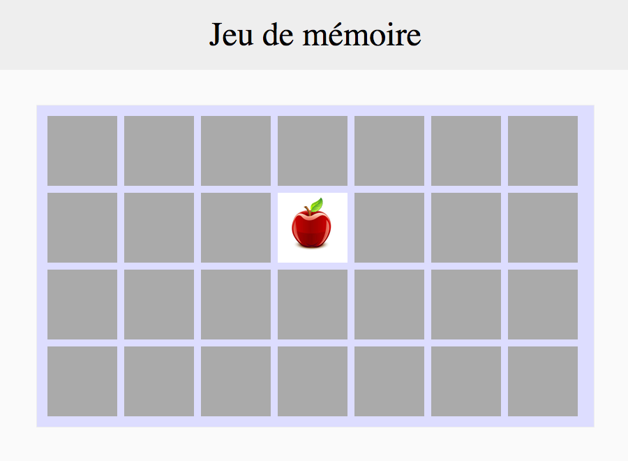

# La face visible

La carte retournée doit afficher une image. 🎨

## Instructions

### La pomme

Il faut ajouter en fond des `.image` le fichier `cards.png` en fond.

### Les fruits

Pour afficher une image différente, on rajoute sur chaque `.image` un `background-position` (technique du « sprite »).
Exemple : `background-position: 0 -100px`

Il y a 28 cartes, soit 14 paires. Il faut donc donner 14 `background-position` différents à chaque paire, lorsque l'on génère les cartes.

### On mélange

Enfin, les cartes doivent être mélangées avant d'être ajoutés au plateau.  
Si on les stocke dans un array avant de les rajouter au plateau, il suffit de mélanger ce tableau ! :smiley:

--

La suite : [Une paire](4_une-paire.md)

---

## Help

* http://stackoverflow.com/questions/6274339/how-can-i-shuffle-an-array
* https://developer.mozilla.org/fr/docs/Web/CSS/CSS_Images/Sprites_CSS
