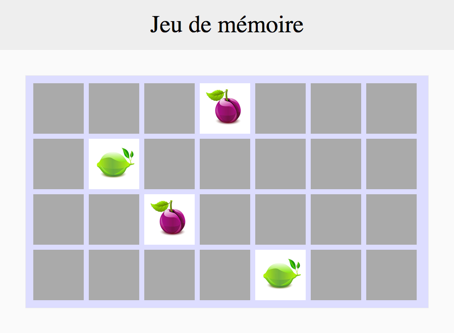

# Une paire ?

Lors du deuxième click, il faut vérifier si les cartes qui viennent d’être retournées sont identiques.

## Instructions

* Il faut tester si les deux cartes ont la même image.

* Si les deux images ne sont pas identiques, il faut attendre un laps de temps (1 seconde) pour que l’utilisateur puisse mémoriser les images, puis les retourner face cachée.

* Pendant le laps de temps, le joueur ne doit pas pouvoir cliquer sur une autre carte.

* Si les deux images sont identiques, le joueur peut cliquer sans attendre sur deux nouvelles cartes.

--

La suite : [Veni, vidi, vici](5_veni-vedi-vici.md)

---

## Help

* https://developer.mozilla.org/fr/docs/Web/API/WindowTimers/setTimeout
