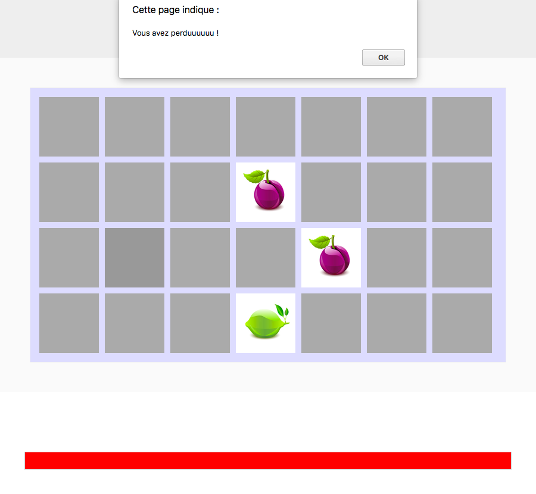

# Tu quoque mi fili

Le jeu est un peu trop simple, rajoutons une petite dose de stress à notre joueur avec un compte à rebours.

## Instructions

Le joueur a une minute pour retourner toutes les cartes du plateau.  
Une barre de progression indique le temps écoulé.

* Il faut afficher une barre de progression sous le plateau de jeu.

* La barre se remplit de rouge petit à petit, et arrive à la fin au bout d’1 minute.

* Une fois le temps écoulé, il faut afficher un message d’echec, et revenir à l’accueil.

--

On continue ?
=> [BONUS](7_bonus.md)

---

## Help

* http://api.jquery.com/animate/
